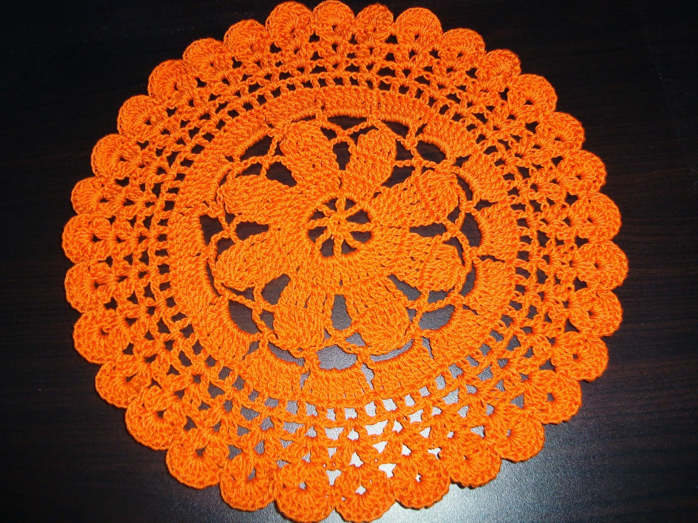
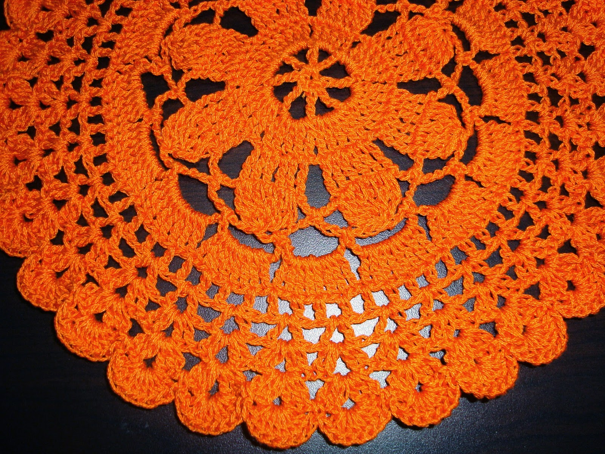

Crocheting is such a versatile craft that with little imagination and knowledge about stitches,any one can create beautiful things . I made this cushion cover with a doily in center. My own design. Doily pattern is from net. I changed the pattern to make it suitable for this  design. The square part of the cushion cover is done with shell pattern , Overall it gives a artistic look. Here I am giving the written pattern for doily and  the square part .

**Skill Level** - Advanced Beginner
         
**Measurement** - 14" square

**Gauge** - 10 sts , 6 row = 2" square

# Material
- Knitting Cotton ( I used Anchor brand )
- color A - for doily any darker one of your choice ( 105-110 m)
- color B - white ( 180 - 185 m)
- Hook size - 3 mm

# Abbreviation (US terms)
- ch - chain
- st(s) - stitch(es)
- sl st - slip  stitch
- sc - single crochet
- dc - double crochet
- tr - treble
- sp(s) - space(s)
- Rnd - Round

## Special stitches
- cluster - keep last loop of each tr in hook ( don't finish the tr), in hook you have 6 loops, pull thread through all the loops to make a 6tr cluster .
- finish  - sl st in 4th ch of beginning 4ch .

> Note
> - Number of  shells in last line of doily must be multiple of four.
> - I have used hook size 3 mm . You can change hook size according to your tension.

     
# PATTERN ( for doily col A)
    
8ch , sl st in beginning ch to make a ring.

**Rnd 1**- 7ch ( counts as a tr,3ch) * 1tr , 3ch * repeat * * 6 more times, sl st in 4th ch of beg 7ch.

**Rnd 2** - 4ch (counts as 1tr through out) , 4tr in next sp, 1ch, * 5tr in next sp , 1ch *, repeat * * 6 more times , finish.

**Rnd 3** - 4ch , tr in next st , 2tr in next st, tr in each next 2 sts , 5ch ,*tr in next 2 sts,2tr in  next st , tr in next 2 sts (6tr), 5 ch* repeat * * 6 more times , finish .

**Rnd 4** - 4ch , * cluster , 6ch , sc in next sp , 6ch * repeat * * 7 more times , finish.

**Rnd 5** - sl st in next 3ch ,sc  in same sp * 8ch , sc in next  sp , 8ch * repeat * * till end, sl st in beg sc.

**Rnd 6** - 4ch , 7tr in next sp ( 8tr) , repeat 8tr in each sp , finish .

**Rnd 7** - 4ch (counts as 1dc , 1ch), skip next dc , * dc in next st , 1ch , skip 1dc *, repeat * * till end , sl st in 3rd ch of beg 4ch.

**Rnd 8** - sl st,get in to next sp , 5ch ( counts as 1dc, 2ch) , dc in same sp,1ch, skip next sp  *  1dc 2ch , 1dc in next sp ,1ch , skip next sp * repeat * * till end , sl st in 3rd ch of beg 5ch.

**Rnd 9** - 2 sl st,get in to next sp , 3ch (counts as a dc) ,1dc,2ch ,2dc in same sp  , repeat 2dc. 2ch , 2dc in each 2ch sp till end , sl st in 3rd ch of beg 3ch .

**Rnd 10** - 3 sl st to next 2ch sp ,3ch , 2dc ,3ch ,3dc in same space, repeat 3dc,3ch,3dc in each 2ch sp till end , sl st in 3rd ch of beg 3ch.

**Rnd 11** - 4 sl st to next 3ch sp , 3ch ,7dc in same sp , sc in next sp, repeat 8dc , sc in  next sp till end , sl st in 3rd ch of beg 3ch.

