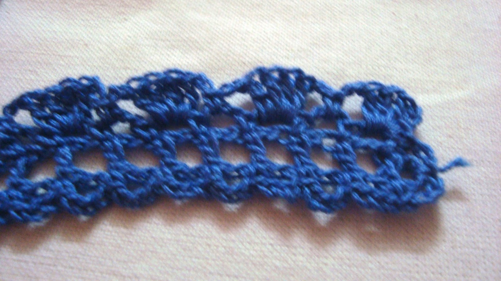

Now a days fancy headbands are must for little girls. And if something beautiful made by MOM always make little one happy. Here is a easy to make cute adorable fashionable crochet headband with flower. It can be done in less than an hour,  such a quick crochet project. It's also a great yarn-buster project. These are  awesome for gift.This is a fantastic project for those just learning how to crochet. 

 
I am sharing the pattern for two sizes for kids and toddler. You can easily alter the size for bigger or smaller.

# Skill Level - Intermediate

# Measurement
Width - 1.5"
              
# Material –
Knitting cotton(3ply) any color of your choice – 20 to 25 m
Hook – 3mm
Tapestry needle, pearl bead  

# PATTERN

Rnd 1 - 1dc in 5th ch from hook,* 1ch, 1dc, repeat from * through out.
Rnd 2 - 3ch, 1sc in beg ch,* 3ch, skip 1st, 1sc in next st, repeat from * till end then repeat same on other side, sl st in beg st.

Rnd 3 -  2sl st, 1sc in next sp, *2ch, 3dc in next sp, 2ch, 1sc in next sp*, repeat * * till end, sl st in beg st.
 

Flower - Get the pattern for

Rope - Using both thread make a rope with chain stitch.

Assemble the band with little sewing and Easy Flower Headband is ready to use.

Hope you will enjoy making these headbands. I appreciate if you share your project out of this pattern in my